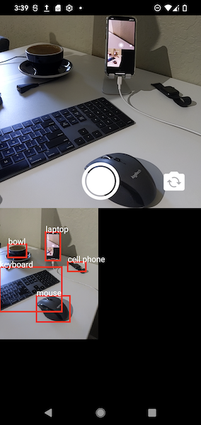
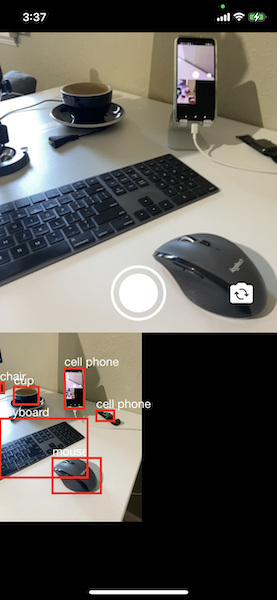

# YOLO Example

The repository contains code for a [PyTorch Live](https://pytorch.org/live) object detection prototype. The prototype uses the [YOLOv5s model](https://github.com/ultralytics/yolov5) for the object detection task and runs on-device. It runs on Android and iOS.

**NOTE: This example uses an unreleased version of PyTorch Live including an API that is currently under development and can change for the final release.**

## How was this project bootstrapped?

The project was bootstrapped with the following command:

```
npx torchlive-cli init YOLOExample --template react-native-template-pytorch-live
```

Unused packages were removed and `react-native` upgraded to version `0.64.3`.

# Screenshots

|Android|iOS|
| --------------------- | --------------------- |
|||

# Run project in emulator or on a device

## Prerequisites

Install React Native development depencencies. Follow the instructions for [Setting up the development environment](https://reactnative.dev/docs/environment-setup) as provided on the React Native website.

## Install project dependencies

Run `yarn install` to install the project dependencies.

## Start Metro server

Start the Metro server, which is needed to build the app bundle (containing the transpiled TypeScript code in the `<PROJECT>/src` directory).

```
yarn start
```

## Android

Build the `apk` for Android and install and run on the emulator (or on a physical device if connected via USB).

```
yarn android
```

See instructions on the React Native website for how to build the app in release variant.

## iOS

Install CocoaPod dependencies

```shell
(cd ios && pod install)
```

Build the prototype app for iOS and run it in the simulator.

```shell
yarn ios
```

or use the following command to open the Xcode workspace in Xcode to build and run it.

```shell
xed ios/YOLOExample.xcworkspace
```

See instructions on the React Native website for how to build the app in release scheme.

# Custom YOLOv5 Model

The model that is used in this example was exported from the [`ultralytics/yolov5.git`](https://github.com/ultralytics/yolov5) GitHub repository. Check the repo for more details on the model and documentation.

### Python environment

It is recommended to create a Python environment to avoid dependency conflicts among other things. For example, check out the documentation on [managing environments](https://docs.conda.io/projects/conda/en/latest/user-guide/tasks/manage-environments.html)) on the Conda website.

### Clone `ultralytics/yolov5.git` GitHub repo

```shell
git clone https://github.com/ultralytics/yolov5.git
```

### Install dependencies to export YOLOv5 model

```
pip install -r requirements.txt
```

### Export YOLOv5s torchscript model

```shell
python export.py --weights yolov5s.pt --include torchscript
```

*Note:* This exported model may crash the app when loaded into the PyTorch Mobile Lite Interpreter runtime. The next step is important to avoid the instacrash.

### Optimize model for PyTorch Mobile use

Optimize the `yolov5s.torchscript` model for use with PyTorch Mobile. Change the filenames if you exported different model weights (i.e., change `yolov5s.torchscript` to match the exported weights).

Copy the code below into a Python file `optimize.py` in the YOLOv5 repo checkout directory.

```python
import torch
from torch.utils.mobile_optimizer import optimize_for_mobile

torchscript_model = "yolov5s.torchscript"
export_model_name = "yolov5s.torchscript.ptl"

model = torch.jit.load(torchscript_model)
optimized_model = optimize_for_mobile(model)
optimized_model._save_for_lite_interpreter(export_model_name)

print(f"mobile optimized model exported to {export_model_name}")
```

Execute script to optimize exported `yolov5s.torchscript` model.

```shell
python optimize.py
```

### Copy optimized model to project

Copy the `yolov5.torchscript.ptl` file to `model/yolov5.torchscript.ptl` in this project.

*Note:* The file extension has to be `ptl`, otherwise Metro will not serve the model to the app.

### Change

Change `MODEL` URL from a public GitHub URL to a `require` resource locally within the project.

To do that, update the following code in `App.tsx`

```
const MODEL =
  'https://github.com/raedle/test-some/releases/download/v0.0.2.0/yolov5s.torchscript.ptl';
```

to this


```
const MODEL = require('../model/yolov5s.torchscript.ptl');
```

The model is now ready to be tested. Rerun the steps "Run project in emulator or on a device" to test!